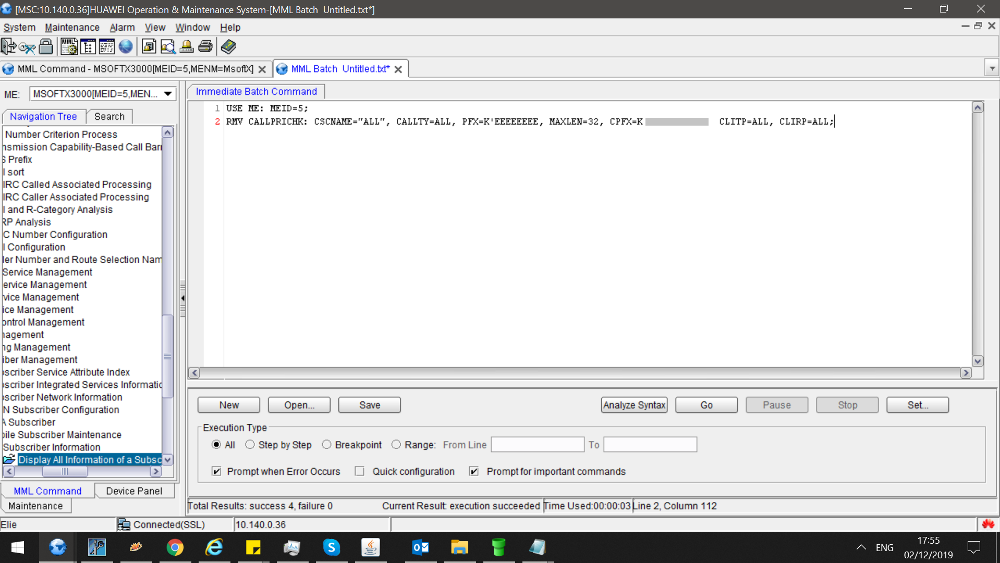
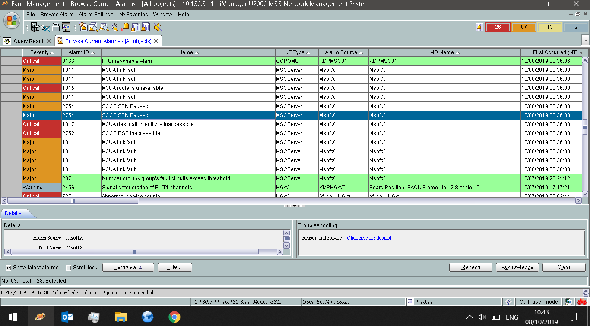
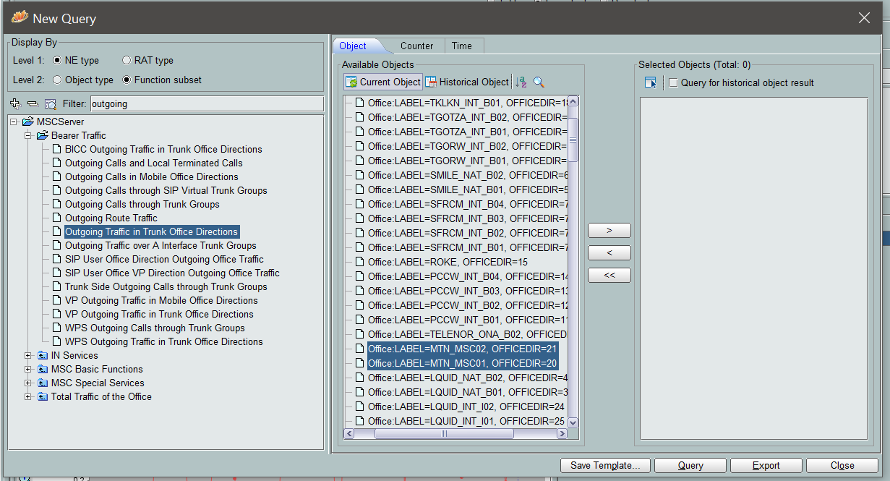
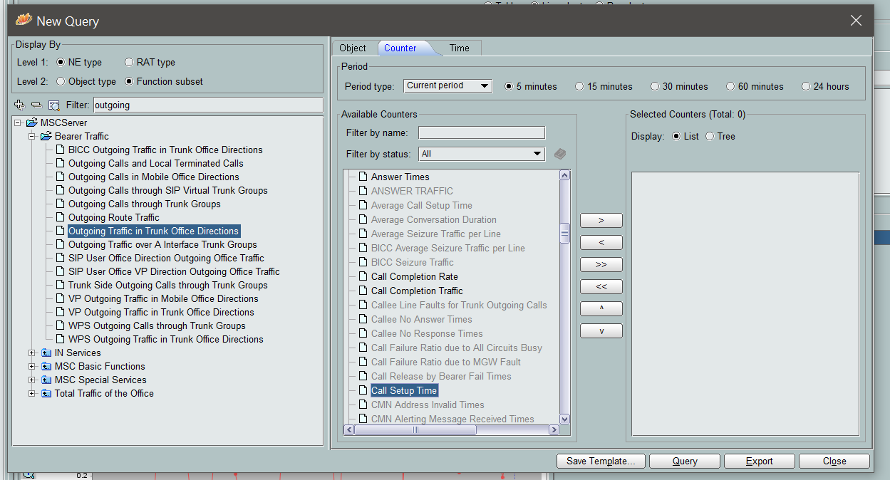
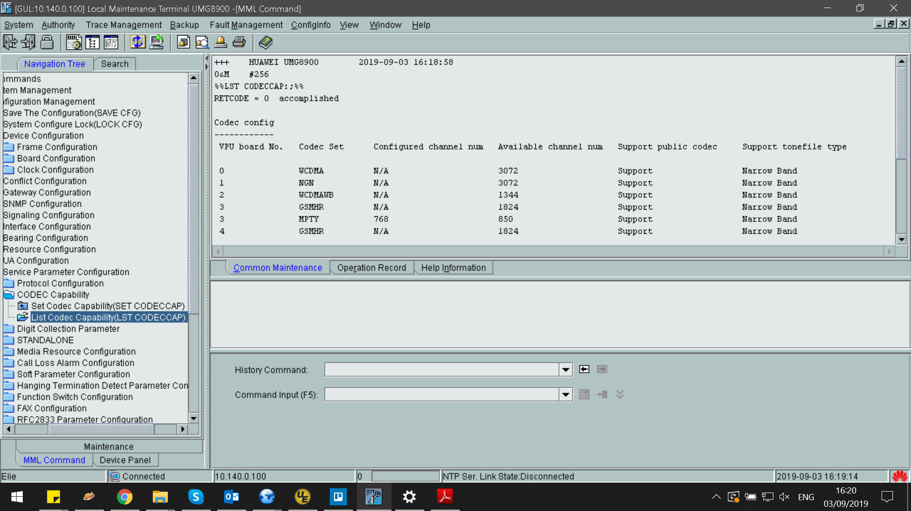
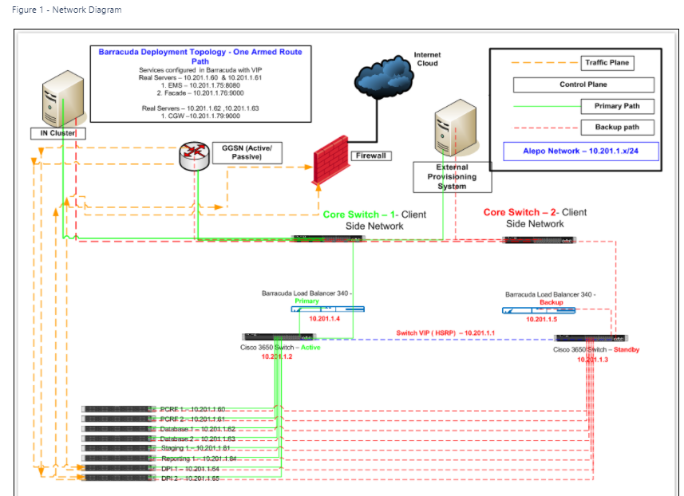
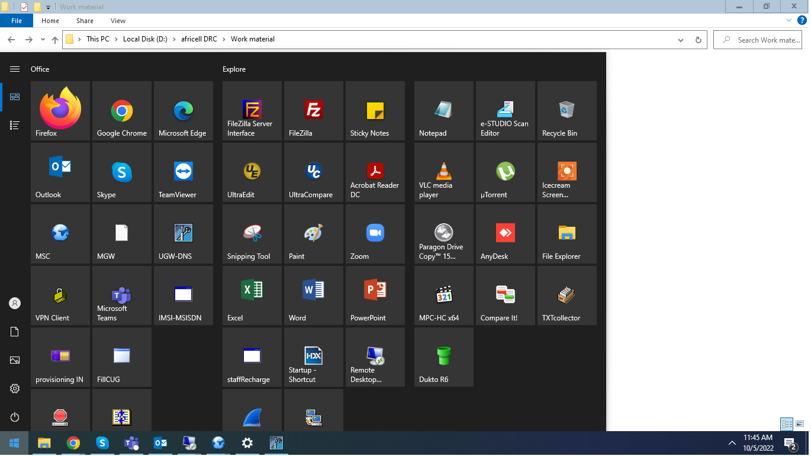
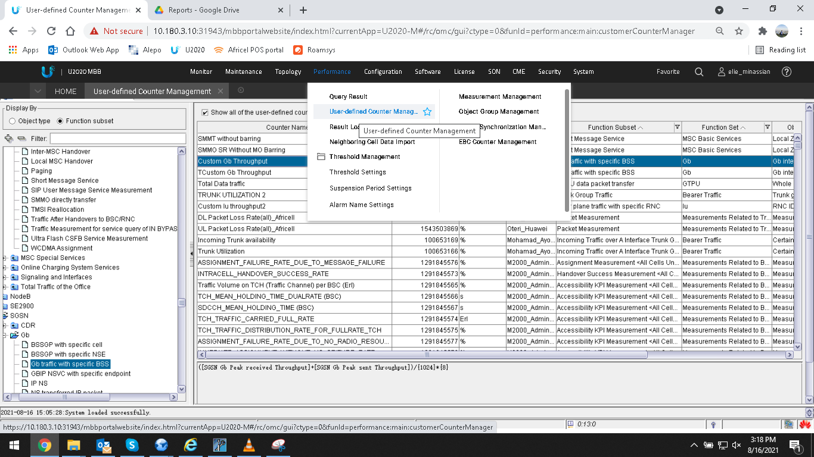
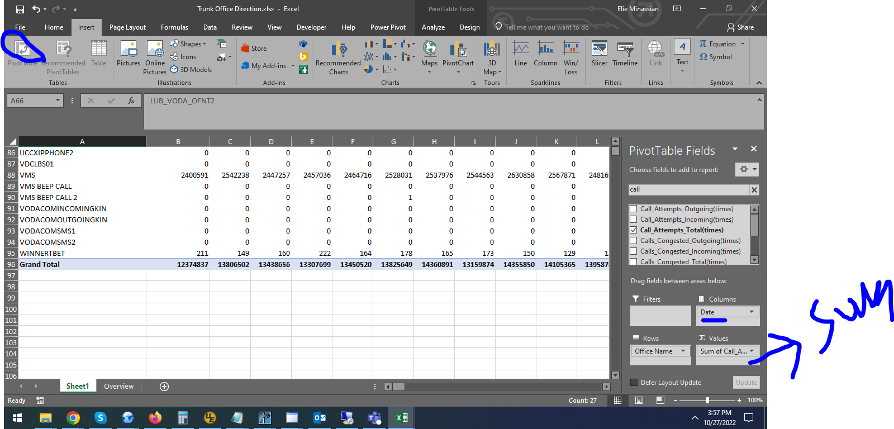

# Elie Minassian · Africell Huawei core

**Core network engineer at Africell** across Uganda, the Democratic Republic of Congo, and Sierra Leone.

Live site: [e-mination.github.io/africell-huawei-core](https://e-mination.github.io/africell-huawei-core/)

Personal record of real core-network work. Credentials, subscriber dumps, and live MML with secrets are left out. This is not an official Africell publication.

[Email](mailto:minassianelie@gmail.com) · [GitHub](https://github.com/e-mination) · [Paris 2024 roaming](https://e-mination.github.io/paris-olympics-2024-roaming-volte/) · [LeChiffre](https://lechiffre.online/)

I work the circuit core, the packet core, and the services hung off them: MSC and MGW, HLR/HSS, SMSC, SGSN and GGSN/UGW, Alepo IN, roaming, M3UA signaling, and u2000.

| Layer | Systems |
| --- | --- |
| MSC server | Huawei MSOFTX3000 |
| Media gateway | UMG / MGW |
| Packet core | USN (SGSN), UGW (GGSN) |
| Subscriber | HLR / HSS |
| Messaging | SMSC, USSD, A2P |
| IN | Alepo |
| Assurance | u2000 |

## Countries

### Uganda

The deepest file is here: a numbered work-order series on the MSC, MGW, USN, UGW, HSS, and u2000, plus roaming tests and weekly KPI packs.

- MSC and MGW licenses, MSOFTX3000 patches, codec and board work, and BSC/RNC migration onto a new MSS.
- SCCP migration and national plus international trunk moves, including SIP toward Sierra Leone.
- USN and UGW upgrades, APN autocorrect, GCDR changes, NTP, BFD, and the cutover to new Infoblox DNS servers.
- HSS license and OMU sync work, and LTE operator-determined barring for outbound roaming.
- Inbound and outbound roaming tests with IR.21 sets across partner networks.
- u2000 extracts for voice, packet core, HLR, VPD, interconnect, and call setup.

### DR Congo

Procedures and node work on the Huawei core and Alepo IN, including a packet-core DPI move and MSC data-fill growth.

- Huawei MML and Alepo command procedures used on the live nodes.
- CUG data-unit recharge flows on the IN.
- UGW DPI shift for Katanga.
- MSC CNACLR table growth and license updates on the nodes.
- Design notes, cell creation support, and the spare-parts and work-order trail beside the core.

### Sierra Leone

APN build, gateway cleanup, messaging interconnect, and the E1/STM edge that the core depends on.

- 3G and 4G APN creation, including designs that bypass Alepo.
- PDP session deactivation and UGW cleanup.
- Fraud-number blocking, and USSD short-code creation.
- E1, TDM, and new STM fiber where transmission meets the core.
- International SIP trunks and PCCW A2P.
- HSS SPID work and a QCI change from 7 to 8.

## Core domains

| Domain | On this core |
| --- | --- |
| MSC | MSOFTX3000 call control: batch MML, office directions, call setup, patches, licenses, MSS rehomes |
| MGW | Codec sets, channel counts, VPU and board recovery, tones, H.248 |
| M3UA | SIGTRAN between the MSC and EIR, IN, and VAS. Link, route, and SCCP faults from u2000 |
| HLR / HSS | Subscriber and APN procedures, SPID, licenses, OMU sync, LTE barring for outbound roamers |
| SMSC | SMS MO/MT, A2P (including PCCW in Sierra Leone), messaging faults |
| SGSN | Huawei USN: upgrades, probes, BFD, hardware, NTP, inactive-user detach |
| GGSN / UGW | Upgrades, PDP cleanup, DPI relocation, APN autocorrect, GCDR |
| APN | 3G and 4G designs, including profiles with Alepo bypassed |
| IN / Alepo | Procedures, CUG recharge, bypass designs, CAMEL destination number in MSC CDRs |
| Roaming | Inbound and outbound partner tests, IR.21, roaming configuration |
| u2000 | Alarms, user-defined counters, PS-node migration, KPI workbooks |

## Screenshot gallery

Real sessions from the Africell core desk. A called prefix on the MSC batch line is masked. No passwords were readable in this set.

### MSC batch script

Immediate batch on MSOFTX3000. The script in view checks M3UA links and the codec type on the MGW. The called prefix in that command is masked.

### M3UA fault toward EIR, IN, and VAS

u2000 current alarms while M3UA between the MSC and EIR, IN, and VAS was down: link fault, route unavailable, SCCP subsystem paused, destination entity inaccessible.

### Call setup — office directions

Object pick for an increased call-setup investigation. The filter is outgoing trunk office directions: national and international routes on the MSC.

### Call setup — counters

Average call setup time, answer times, seizure traffic, completion rate, circuits-busy failures, and failures due to MGW fault.

### MGW codec capability

`LST CODECCAP` on the media gateway: VPU codec sets, configured and available channels, narrowband support, and tone-file type.

### Alepo IP design

IN platform layout: client-side core switches, active and standby nodes, and the addressing around them. No credentials are on the drawing.

### Operations toolkit

LMT-style clients for MSC, MGW, and UGW/DNS, IN utilities, Office, and remote access used to reach the nodes.

### u2000 user-defined counters

Trunk utilization, handover, IN bypass, and packet-loss formulas, saved as user-defined counters rather than one-off queries.

### Trunk office traffic

Those extracts landed in Excel. This pivot is trunk-office call attempts — the reporting half of the same interconnect and MSC work.

## Skills

**Signaling and media.** M3UA, SCCP, SIGTRAN, BICC, SIP trunks, H.248, E1/TDM, STM fiber, point codes, linksets, office directions, MGW codec sets.

**Circuit and subscriber core.** Huawei MSOFTX3000, UMG/MGW, HLR/HSS, SMSC and A2P, USSD short codes, CLI and number-blocking controls.

**Packet core.** USN (SGSN), UGW (GGSN), APN design for 3G and 4G, PDP cleanup, QCI, DPI, GCDR, Infoblox DNS cutover.

**IN, roaming, and assurance.** Alepo procedures and CUG recharge, CAMEL fields in MSC CDRs, inbound and outbound roaming, IR.21, LTE ODB, u2000 alarms and counters, license and patch windows.

## Contact

I am open to telecom core roles — MSC, packet core, signaling, roaming, and IN — on Huawei and multi-vendor teams.

- **Elie Minassian** — Core Network Engineer, Africell
- Email: [minassianelie@gmail.com](mailto:minassianelie@gmail.com)
- GitHub: [e-mination](https://github.com/e-mination)

### Other public work

- [Paris 2024 roaming and VoLTE](https://e-mination.github.io/paris-olympics-2024-roaming-volte/) — inbound and outbound roaming at Bouygues Telecom (IR.21, VoLTE, IR.25). [Repository](https://github.com/e-mination/paris-olympics-2024-roaming-volte).
- [LeChiffre](https://lechiffre.online/) — a separate Pine Script / TradingView project. [Repository](https://github.com/e-mination/lechiffre-trading).

## What is not in this repository

- Passwords, community strings, and other live credentials
- IMSI or MSISDN dumps and subscriber extracts
- Full MML exports, address books, and personal HR documents

The static site is `index.html`, styled from `css/styles.css`. GitHub Pages serves it from the `main` branch root.
